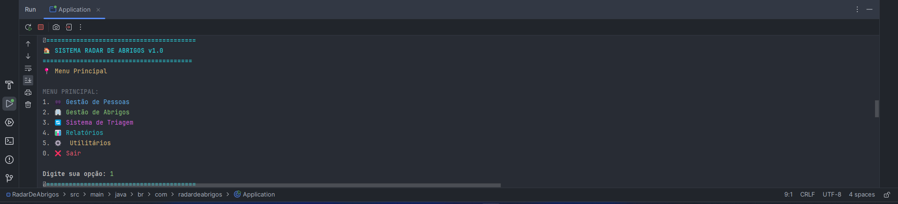
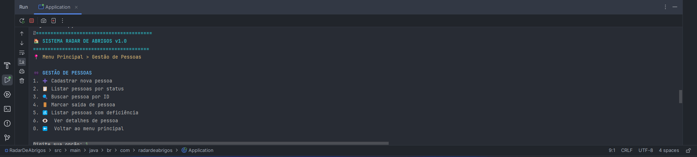
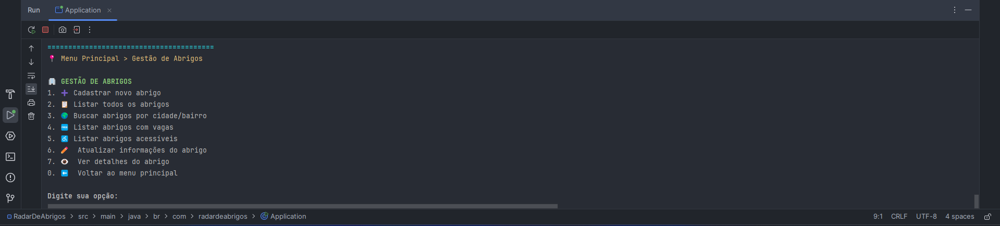
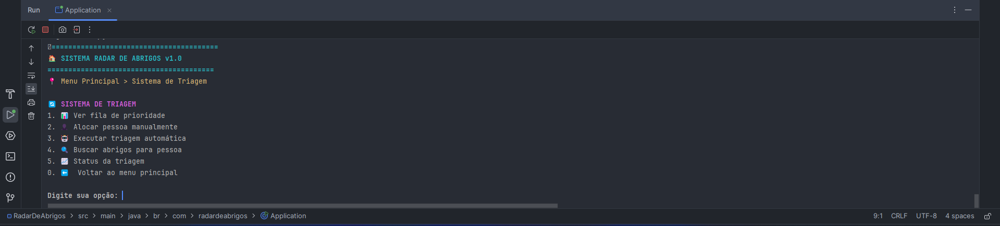
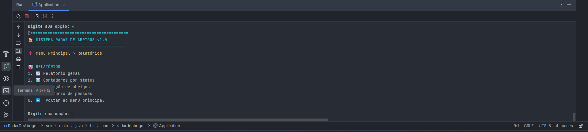
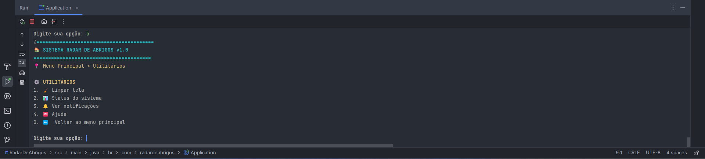

# 🌪️ Radar de Abrigos

O **Radar de Abrigos** é uma aplicação desenvolvida para apoiar a logística de abrigos temporários durante desastres naturais, facilitando o gerenciamento e a triagem de pessoas desabrigadas.

## 🗒️ Sobre o Projeto

Durante o evento **Global Solution** da FIAP, participei do desenvolvimento de uma solução inovadora com foco no enfrentamento de eventos climáticos extremos. O projeto tem como principal objetivo otimizar o processo de alocação de pessoas em abrigos, considerando critérios de capacidade, acessibilidade e localização.

## 📸 Imagens do Projeto
> Abaixo algumas imagens que ilustram o funcionamento das principais funcionalidades do Radar de Abrigos:


*Figura 1: Tela inicial da aplicação com o menu principal exibindo as funcionalidades do sistema.*


*Figura 2: Endpoints da API voltados para a gestão de pessoas.*


*Figura 3: Endpoints da API voltados para a gestão de abrigos.*


*Figura 4: Endpoints disponíveis para a gestão do sistema de triagem, permitindo desde a visualização da fila de prioridade até a execução de triagem automática e consulta de status.*


*Figura 5: Menu de relatórios com opções para gerar contadores por status, ocupação de abrigos e relatório detalhado de pessoas.*


*Figura 6: Funcionalidades utilitárias disponibilizadas no sistema, abrangendo comandos para resetar interface, consultar estado operacional, acessar documentação e controlar notificações automáticas.*

## 🛠️ Tecnologias Utilizadas

- Java + Spring Boot
- Hibernate + JPA Repository
- Arquitetura MVC
- API RESTful
- Oracle Database

## 📊 Principais Atividades

- Desenvolvimento do back-end com Java e Spring Boot
- Implementação de regras de negócio para triagem e alocação de pessoas
- Integração e modelagem do banco de dados Oracle
- Construção das APIs REST seguindo boas práticas de desenvolvimento

## ⚙️ Funcionalidades Implementadas

✅ Cadastro de abrigos (públicos e voluntários)  
✅ Cadastro de pessoas desabrigadas  
✅ Triagem inteligente com prioridade para pessoas com deficiência  
✅ Controle de capacidade e alertas de abrigo lotado  
✅ Busca por localização (cidade/bairro)  
✅ Relatórios em tempo real  
✅ API REST completa  
✅ Banco de dados Oracle  
✅ Notificações automáticas  
✅ Sistema de usuários e permissões.  

## ▶️  Como Executar

> Este projeto utiliza Spring Boot, portanto basta ter o Java 17+ e um Oracle Database disponível para configuração.

```bash
# Clone o repositório
git clone https://https://github.com/MathLaborde/RadarDeAbrigos.git

# Navegue até a pasta do projeto
cd RadarDeAbrigos

# Configure o arquivo application.properties com os dados do seu Oracle Database
# Exmeplo:
  spring.application.name=RadarDeAbrigos

  spring.datasource.url=jdbc:oracle:thin:@localhost:{PORTA}:XE
  spring.datasource.username={USUARIO}
  spring.datasource.password={SENHA}

  # JPA/Hibernate
  spring.jpa.hibernate.ddl-auto=update
  spring.jpa.show-sql=false
  spring.jpa.properties.hibernate.format_sql=true
  spring.jpa.open-in-view=false

  # Configurações da aplicação
  server.port=8080

  spring.datasource.driver-class-name=oracle.jdbc.OracleDriver

# Execute a aplicação
./mvnw spring-boot:run
```
---

## 👨‍💻 Equipe

Projeto desenvolvido por alunos da **FIAP** durante o evento Global Solution (onde desenvolvemos soluções para problemas relacioanados a eventos globais, utilizando tecnologia).

---

📌 *Este projeto é acadêmico e foi desenvolvido com fins educacionais.*
